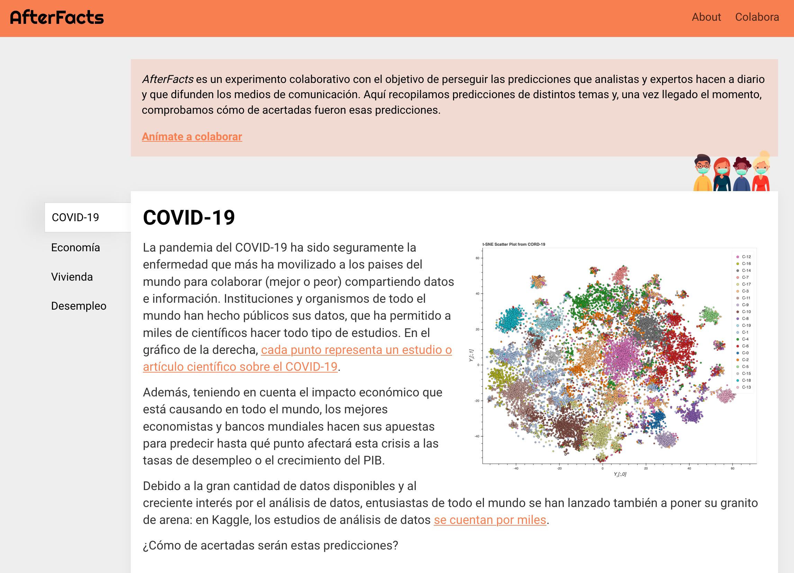

# AfterFacts

> **Para que no nos olvidemos de las predicciones.**



> [!NOTE]
> **Archival Notice:** This project was created as a test and is currently preserved for archival purposes. It is no longer actively maintained.

AfterFacts is a static platform designed to track and verify public predictions about major global events. Originally focused on the COVID-19 pandemic, the project aims to compare expert and institutional forecasts with actual outcomes to provide a clear view of prediction accuracy.

## Overview

Public figures and institutions frequently make bold predictions about economic trends, public health, and societal changes. AfterFacts serves as a repository for these forecasts, documenting:
- **Economic Indicators:** GDP growth, unemployment rates, and housing market trends.
- **Public Health:** COVID-19 infection peaks and mortality rates.
- **Societal Impact:** Predictions about the return to normalcy, events, and festivals.

## Built With

- **[Jekyll](https://jekyllrb.com/):** A simple, blog-aware, static site generator.
- **Markdown:** For structured and easy-manage content.
- **GitHub Pages:** For seamless hosting and deployment.

## Getting Started

To run this project locally, ensure you have Ruby and Bundler installed.

1.  **Install dependencies:**
    ```bash
    bundle install
    ```

2.  **Start the development server:**
    ```bash
    bundle exec jekyll serve --livereload 2>&1 | egrep -v 'deprecated'
    ```

3.  **View the site:**
    Open your browser and navigate to `http://localhost:4000/afterfacts.github.io` (or the URL provided in the terminal).

## 📄 License

This project is licensed under the MIT License - see the [LICENSE](LICENSE) file for details.
